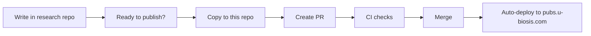

# 思考の本棚 / Bookshelf of Thoughts

An open archive of thoughts built on General Systems Theory.

一般システム論をベースにした思考の公開アーカイブ。

**Site**: https://pubs.u-biosis.com

## Workflow



## Contents

| Section | Description | Language |
|---------|-------------|----------|
| [Core Theory](https://pubs.u-biosis.com/core/) | 創発文明論 — Emergent Civilization Theory | ja (en planned) |
| [AI](https://pubs.u-biosis.com/ai/) | Agent Design / Implementation / Literacy | ja (en planned) |
| [Notes](https://pubs.u-biosis.com/notes/) | Miscellaneous notes | ja |

## Writing

Markdown plugins available:

- **MathJax3** — `$$V = f(S, R, T)$$` for block math, `$x^2$` for inline
- **Mermaid** — ` ```mermaid ` code blocks for diagrams (flowchart, graph, sequence, etc.)
- **PlantUML** — `@startuml` / `@enduml` for class diagrams, sequence diagrams, etc.

## Development

```bash
npm ci
npm run docs:dev
```

## Feedback

Issues and suggestions are welcome via [GitHub Issues](https://github.com/kishibashi3/publications/issues).

## License

- **Code** (VitePress config, workflows): [MIT](./LICENSE)
- **Content** (`docs/core/`, `docs/ai/`, `docs/notes/`): [CC BY-SA 4.0](./LICENSE-CONTENT)
