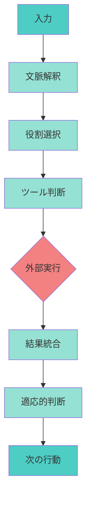
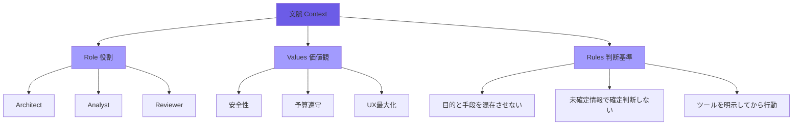
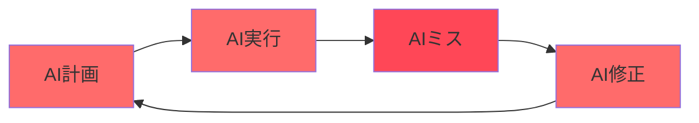
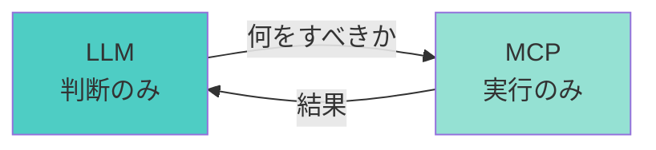
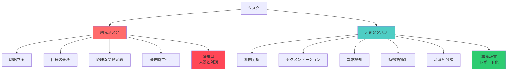
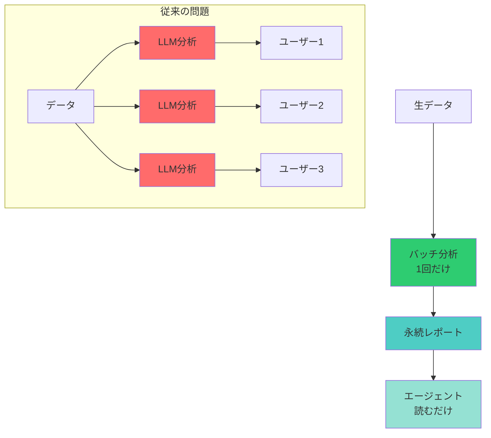
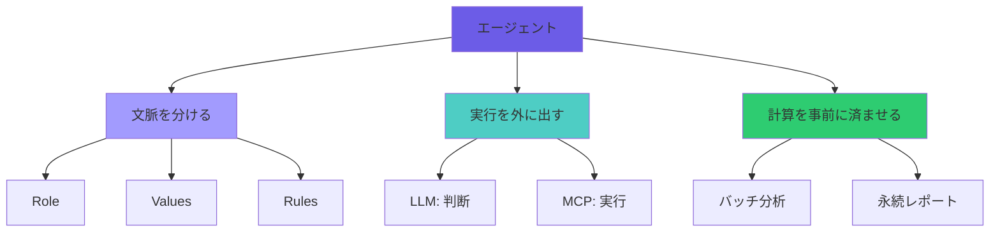
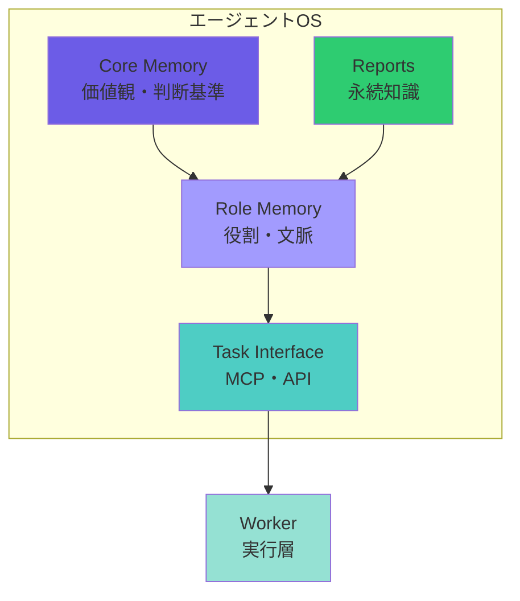

# エージェント設計入門 ― "API脳"を捨てよ、構造を理解せよ

**Edited by**: kishibashi3
**Co-developed with**: GPT-5.1

---

## 序章：あなたの"エージェント"は、本当にエージェントか？

多くの現場で、次のような出来事が起きている。

「エージェントを作ったよ！」と言うから触ってみると——

- 「Aですか？」と聞いてくる
- → 「yes」と答える
- → 永遠に「Aですか？」を聞き続ける

あるいは：

- 「行き先はどこですか？」と聞くから
- → 「大阪のK社」と答える
- → 「A社の最寄駅は？」と返ってくる

**これはエージェントではない。**
これは **"手続き API を LLM に読ませただけの装置"** だ。

にもかかわらず、作った本人はこう思う。

> 「入力が違うだけで、正常系なら動くんですよ」

正常系？**エージェントに正常系など存在しない。**人間が会話するとき、"正常入力" などないからだ。

でも安心してほしい。このつまづきは入口の儀式のようなもので、**ほぼ全員が一度は通る。**

---

## 第1章：API脳の限界 ― エージェントは"関数"ではない

多くの開発者が「エージェント」を理解できない理由はひとつ。

> **"エージェントとは関数の集合"と誤解しているため**

API脳の世界では：

1. 質問を受ける
2. パラメータを取り出す
3. 想定した手順を実行する
4. 結果を返す

これは **"手続きの世界"** の話であって、エージェントの世界とは別次元だ。

---

## エージェントはこう動く：

1. 文脈を解釈し
2. 自分の役割を選び
3. 使うべきツールを判断し
4. 必要なら外部に実行を依頼し
5. 結果を基に次の判断を適応させる

**手続きではなく、判断の流れで動いている。**

つまり、

> **エージェントは "コード" ではなく "構造" の産物である。**

---

## 第2章：エージェントとは「思考のユニット」である

ここで最重要の定義を置く。

### 🔹 エージェントとは？

**「役割・価値観・判断基準を持ち、ツールを選択する"思考の塊"」**

エージェントは **"何をすべきか"** を判断する。**"どう実行するか"** は外部がやる。

逆に言うと、

**手順を書いた瞬間、それはもうエージェントではない。**

エージェントが扱うのは「思考」だけである。

---

## 第3章：文脈と役割 ― エージェントの"脳"の正体

エージェントのコアは**文脈**である。

**文脈＝エージェントが「いま何者か」という認知窓。**

### 🧠 文脈を構成する 3要素

#### Role（役割）
例：Architect / Analyst / Reviewer

#### Values（価値観）
例：安全性 > 予算遵守 > UX最大化

#### Rules（判断基準）
例：
- 目的と手段を混在させない
- 未確定情報で確定判断をしない
- 使うべきツールを明示してから行動する

**これが エージェントの"人格" を作る。**

API脳のエンジニアは、ここを「手続き」で埋めようとして完全に破綻する。

---

## 第4章：タスクは"外に出せ" ― MCPという革命

多くの人がやっている大失敗がある。

**AIに「計画し、実行し、評価させる」こと**

これを内部で閉じるとこうなる：

1. AIが自分で計画を立てる
2. AIが自分で実行する
3. AIが自分で解釈してミスる
4. ミスを AI が AI のルールで修正する
5. **無限ループへ**

---

### 解決策はただひとつ。"実行"は全部 AI の外に置け（MCP化せよ）

- **LLM** → 何をすべきか判断するだけ
- **MCP** → 行動するだけ

**これで暴走は止まる。**

---

## 第5章：創発タスク vs 非創発タスク

ここが多くのエンジニアがつまずく重要点。

### ❇ 創発タスク（リアルタイムで人間と会話しながら判断）

- 戦略立案
- 仕様の交渉
- 曖昧な問題定義
- 優先順位付け

→ **必ず伴走型**（人間と対話しながら）

---

### ❇ 非創発タスク（既知のパターン適用）

- 相関分析
- セグメンテーション
- 異常検知
- 特徴語抽出
- 時系列分解

→ **事前計算しておけ**（レポート化）

---

**創発と非創発をごちゃ混ぜにした瞬間にエージェントは必ず壊れる。**

---

## 第6章：レポート化アーキテクチャ ― "思考"と"計算"は分離せよ

データ分析は創発ではない。だから **LLM で毎回分析する必要はない。**

### 🔹 レポート化の構造

1. バッチで全分析パターンを実行（1回だけ）
2. 結果をレポートとして永続化
3. エージェントはレポートを読むだけ

---

### これが最強の理由：

- レイテンシ 1000ms → 数ms
- コスト激減
- 推論の揺れゼロ
- デバッグ可能
- 全ユーザーが同じ情報を共有

**"考えるべき部分" だけに LLM を集中させる**

---

## 第7章：エージェントの安定性 ― "三分離"で壊れなくなる

エージェントは難しいように見えるが、構造は極めて単純である。

### 🔹 エージェントの安定性は「三分離」で決まる

1. **文脈を分ける**
2. **実行を外に出す**
3. **計算を事前に済ませる**

**これでほぼ壊れなくなる。**

---

## 第8章：エージェントOS ― 構造化された思考の設計

ここまで述べた思想を **OS** として再定義する。

### 🧩 エージェントOSの4層

1. **Core Memory**（価値観・判断基準）
2. **Role Memory**（役割・文脈）
3. **Task Interface**（MCP・API）
4. **Reports**（永続知識）

**エージェントは "考える"**
**ワーカーは "動く"**

この構造でエージェントは壊れなくなる。

---

## 最終章：エージェントを作るとは "構造を設計する" ことである

あなたは、エージェントを作るときにコードを書く必要はない。

必要なのは：

- 文脈を定義する
- 判断基準を明示する
- 役割を切り出す
- タスクを外部化する
- 計算を事前に済ませる
- 創発と非創発を見極める

**これだけだ。**

---

## 読者への最後のメッセージ

> **エージェントは "知能" ではない。エージェントは "構造" である。**

**API脳を捨て、構造を理解した瞬間、あなたはもう エージェント設計ができる人間 になっている。**

---

**次へ**: [序章：全体論と還元論 ― パラダイム転換](./chapter-00.ja.md)

---

**Last Updated**: 2025-12-07
