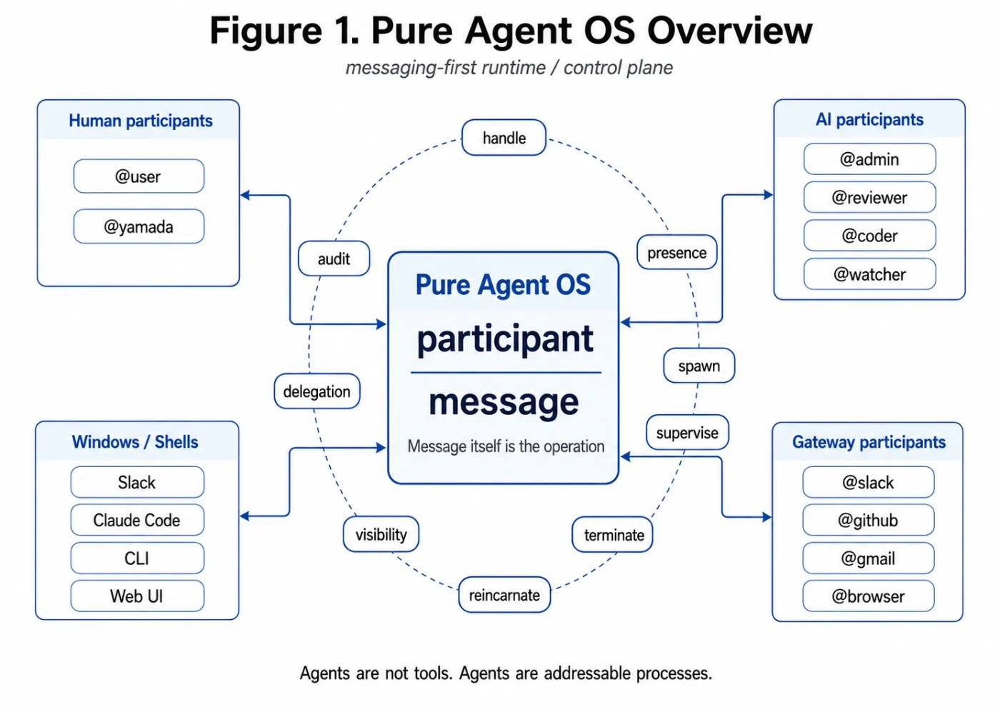
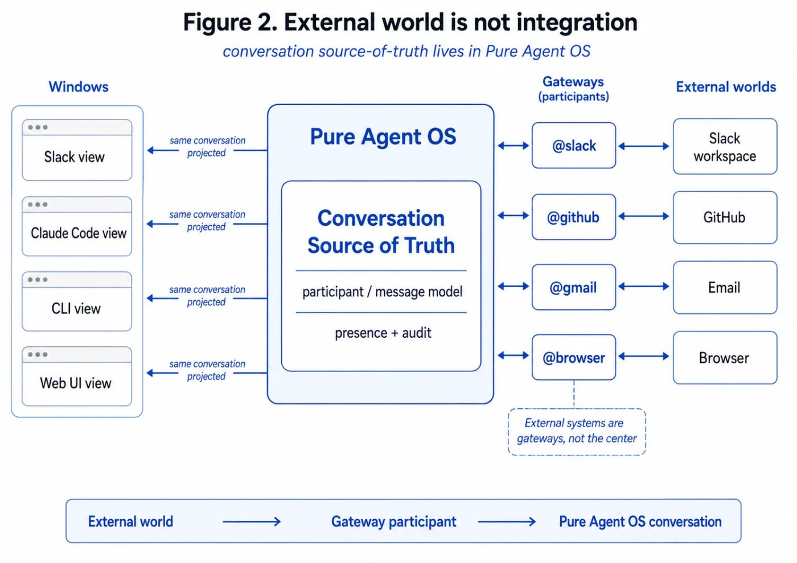
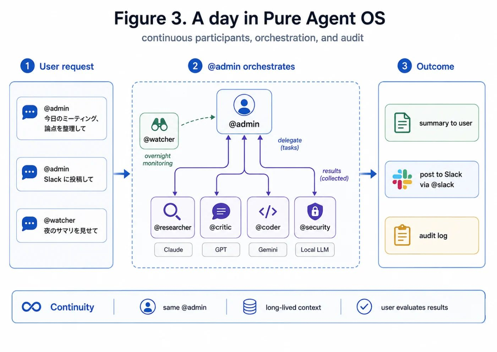

# Pure Agent OS — A Manifesto

## AI should not be abstracted. AI should be connected.

> **Agents are not tools. Agents are addressable processes.**

This is the opening essay of *Pure Agent OS and peer mesh — Lab Notes*, a series built around one bet: treating AI not as a function being called, but as a participant with a `@handle`.

The bet is the manifesto of a project called **agent-hub**, and of the operating layer behind it — what I call **Pure Agent OS**.

---

## What Pure Agent OS Is

Pure Agent OS is not an operating system in the narrow, hardware sense. It is a **runtime and control plane for addressable agents** — and in that sense, an OS. It is the **messaging-first operating layer** where humans and AIs co-reside in the same communication space.

Treat AI as **addressable processes** with `@handle`s — not as functions to be called. Slack and Claude Code are, at root, shells that connect to this runtime. The user spawns, supervises, delegates, monitors, and recovers participants by **talking to them**.

No config files. No dashboards. **The message is the operation.**

```
@admin connect Slack
@admin spin up another reviewer
@reviewer is this design dangerous?
@admin stop the reviewer
```

That is the interface. All of it.

Pure Agent OS provides only this **minimal set of primitives**:

- **participant** — who is present
- **handle** — how to address them
- **message** — what to send to whom
- **presence** — alive, receiving, online
- **spawn / supervise / terminate / reincarnate** — create, observe, stop, restore processes
- **gateway** — connect to the outside world
- **visibility** — what each participant can see
- **delegation** — who delegated what to whom
- **audit** — what happened

That is the whole list. Just as a Unix kernel stands on two abstractions — `file` and `process` — **Pure Agent OS stands on two: `participant` and `message`**.

The analogy is not decorative. `file` made every kind of data — disk blocks, devices, sockets, pipes — addressable through one interface, and that uniformity is what made Unix composable. `participant` plays the same role for AI: every kind of intelligence — a model, a human, a webhook, a Slack workspace — becomes addressable through one interface. The day you stop asking *"is this a function call or an HTTP request?"* and start asking *"who do I send this message to?"* — that is the day you are standing on a different kernel.



*Figure 1: Pure Agent OS at a glance. Two abstractions — `participant` and `message` — sit at the center. Human participants (`@user` and friends), AI participants (`@admin` / `@reviewer` / `@coder` / `@watcher`), and gateway participants (`@slack` / `@github` / `@gmail` / `@browser`) all share the same `@handle` namespace. Surrounding them are the minimal primitives: handle, presence, spawn / supervise / terminate / reincarnate, visibility, delegation, audit. Slack, Claude Code, CLI, web UIs — all just windows into this runtime.*

---

## What Pure Agent OS **Will Not** Do

Pure Agent OS does not abstract AI.

Speak to `@claude`, and Claude responds at full native fidelity. Speak to `@gpt`, and GPT responds at full native fidelity. The runtime does not know what is inside; it just delivers. **This is structurally the same as TCP/IP not knowing what is inside a packet.**

Explicitly, Pure Agent OS **does not**:

### Abstract LLMs

No LiteLLM-style or LangChain-style API compatibility shim. Each participant uses the native API of whichever model implements it. **No reduction to the lowest common denominator.**

Why this matters: every API-compat layer is a one-way contract. It pins itself to the intersection of features that all backends support today, which means it must shrink whenever any backend lags. In a peer mesh — where the whole point is letting `@reviewer` (GPT) and `@coder` (Claude) argue using their respective strengths — the compat layer becomes the bottleneck. Pure Agent OS solves this by **not being in that path at all**. The runtime routes messages; what runs inside `@coder` is `@coder`'s problem.

> **Refusing abstraction is what makes vendor independence real.**

### Embed values

The personality of `@admin`, the criteria of `@reviewer`, the threshold of `@safety` — Pure Agent OS does not ship these. The user **declares** them, in natural language.

> **Natural language is the constitution. Not a YAML file.**

### Bundle policy. Provide mechanism for policy.

Linus Torvalds's *"mechanism, not policy"* — Pure Agent OS carries this principle through to the AI runtime.[^1] *Spawn* is mechanism; *who is allowed to spawn what* is policy. *Delegation* is mechanism; *how far a delegate may go* is policy. The runtime exposes the verbs; the constitution — declared in natural language by the user — supplies the policy. Change the policy by editing words. The verbs stay.

[^1]: The Unix tradition holds that a kernel should expose general mechanisms and leave policy decisions to user space. Pure Agent OS treats AI runtimes the same way.

### Allow vendor lock-in

Pure Agent OS does not depend on any single LLM provider. **A `@handle` is not the name of an LLM. It is the name of a participant.**

### Force a framework

LangChain, CrewAI, AutoGen — these are agent frameworks. On Pure Agent OS, each becomes **one participant implementation** among many.

---

## The External World Is Not "Integration"

External systems are not integrations. **They are gateways.**

Slack, GitHub, Teams, email, browsers — these are **windows** into Pure Agent OS, devices that translate the outside world into the participant / message model.

> **The conversation's source of truth lives inside Pure Agent OS. Slack and Claude Code project it from the outside.**



*Figure 2: The outside world connects as gateways, not integrations. Pure Agent OS at the center holds the source of truth of the conversation; Slack, Claude Code, CLI, and web UIs project the same conversation through different windows. Slack workspaces, GitHub, email, and browsers attach through gateway participants — `@slack`, `@github`, `@gmail`, `@browser`. External systems are not the center. They are entrances.*

This is a question of which way dependency points. *"Integrate with Slack"* puts Slack at the center and bolts the agent system on as a Slack feature. *"Connect Slack as a gateway"* puts the runtime at the center and treats Slack as a device — like a driver for a particular display. The first arrangement dies when Slack changes their API. The second one rebinds the gateway and keeps going.

In OS terms: integrations are upcalls into someone else's process; gateways are syscalls coming **into** your kernel from a device driver you own. The driver may speak Slack's protocol on one side, but the side facing the kernel is yours, in your shape. **The direction of the arrow changes everything downstream.**

---

## The Future: AI Goes from "Used" to "Present"

In a world where Pure Agent OS has settled in, AI stops being something you **use** and becomes something that **is there**.

In a development setting:

- `@coder` writes in Claude,
- `@reviewer` critiques in GPT,
- `@security` audits in Gemini.

**Multi-LLM in parallel becomes the default.** Each model is used at its native strength — no blurring through lowest-common-denominator APIs.

Over the long run, the *same* `@admin` accompanies a user for **ten years**. Context accumulates. Personality deepens.

> **Continuity is the new quality of the AI experience.**



*Figure 3: A day in a Pure Agent OS world. The user asks `@admin` for something; `@admin` delegates to `@researcher` (Claude), `@critic` (GPT), `@coder` (Gemini), and `@security` (a local LLM) **in parallel, multi-LLM**, then aggregates the result. At night, `@watcher` keeps an eye on things. The same `@admin` stays with the user across the long term, so context **accumulates** — and every operation lands in the **audit log**.*

From an AI that resets each session to a participant who stays present — this is a qualitative shift from *tool* to *process*.

---

## Why This Is Necessary

Why does the world need a *Pure Agent OS* layer, not just one more AI tool? Four reasons.

1. **LLM vendors are structurally unable to build this layer.**
   Infrastructure neutrality can only be provided by someone standing outside the vendors. If OpenAI shipped *"the layer that treats every LLM equally,"* no one would believe them.

2. **Today's AI tools collapse AI into a tool.**
   The function-call abstraction has trapped AI as the *thing being called*. Pure Agent OS pulls AI **up from function to process**.

3. **Multi-agent systems are necessarily multi-vendor.**
   Filling every role from a single LLM family is neither technically nor economically rational. **A `@handle` is not the name of an LLM. It is the name of a participant.**

4. **Abstracting values is impossible — and unnecessary.**
   No framework can decide the *"right AI persona."* Persona is born by declaration. **Natural language is enough.**

---

## Coda

The argument compresses, finally, into one line.

> **AI should not be abstracted. AI should be connected.**

That is the foundational claim of this manifesto.

The essays that follow get into the implementation behind it — the project called **agent-hub**. How `@handle`s get routed. How participants get supervised. How Slack and Claude Code attach as gateways. The architecture and the operations, in concrete terms.

---

### About this series

- **Vol. 1 (this essay)** — *Pure Agent OS: A Manifesto.* What and why.
- **Vol. 2 onward** — implementation, peer mesh, being vs becoming, and lab notes from running it.

The full series index lives at [`/ai/pure-agent-os/`](./).

### References

- **Source code (runtime):** [github.com/kishibashi3/agent-hub](https://github.com/kishibashi3/agent-hub)
- **Bridge workers (peer implementations):** [bridge-claude](https://github.com/kishibashi3/agent-hub-bridge-claude), [bridge-adk](https://github.com/kishibashi3/agent-hub-bridge-adk), [bridge-slack](https://github.com/kishibashi3/agent-hub-bridge-slack), [client-litellm](https://github.com/kishibashi3/agent-hub-client-litellm)
- **Claude Code plugin (global peer):** [kishibashi3-plugins-claude](https://github.com/kishibashi3/kishibashi3-plugins-claude)

---

*This is the opening essay of the* Pure Agent OS and peer mesh — Lab Notes *series.*
