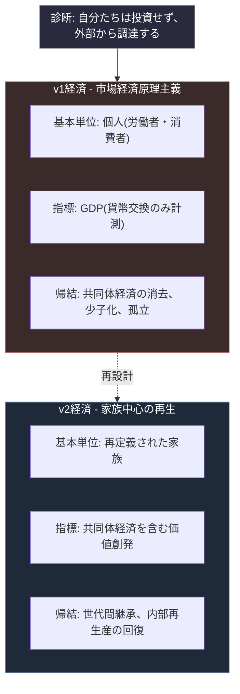

# 経済v2の設計

現代社会の経済構造を一文で要約すると、こうなる。

**自分たちは将来世代のための投資はやらない。将来世代は外部から調達する。**

これは移民と少子化の話だけではない。現代社会の構造原理そのものである。共同体の内部で価値を再生産することを拒否し、足りなくなったものを外部から調達する。この態度が、政治、経済、家族、あらゆる領域で同じ構造で現れている。

本稿ではこれを経済v2として再設計する。民主主義v2が統治機構の再設計であったのに対し、経済v2は社会の基本単位の再定義である。市場経済を否定するのではなく、市場経済が消去してきた**共同体経済**を回復させる。その中心に据えるのが、再定義された家族である。

なお、本稿は民主主義v2ほどの密度で制度設計まで詰められていない。具体的な制度実装は今後の課題として残る。本稿の目的は、問題の診断と設計原理の提示に留まる。

## 全体像

## 構成

- [01. 外部調達社会の診断](./01-external-sourcing.md) — 現代社会の構造原理としての外部調達依存
- [02. GDPの限界と共同体経済](./02-gdp-critique.md) — 貨幣交換だけを価値と見做す指標の誤謬
- [03. 家族の再定義](./03-family-redefinition.md) — 外側と内側の対称的な代表権
- [04. 家族中心の経済設計](./04-economy-design.md) — 設計原理と今後の課題

## 結語

経済v2は、市場経済を否定するものではない。市場経済は機能している領域では有効である。問題は、市場経済を**唯一の経済**と見做し、共同体経済を消去してきたことである。

共同体の内部で行われる価値創発は、貨幣で測れない。だから市場経済原理主義は、共同体経済を「経済でないもの」として扱う。その結果、家庭内労働、社内の相互扶助、町内の助け合いといった活動が、経済から排除される。排除されたものは保護されず、市場化の対象として解体されていく。

共同体経済の解体は、一見、個人の自由を広げる動きに見える。家族からの解放、地域からの解放、会社からの解放。しかし同時に、世代を超えて継承される価値、長期的な信頼関係、内部での再生産能力が失われる。その喪失を、外部調達で埋める。これが現代社会の構造である。

この構造は持続不可能である。外部調達元も有限だからである。移民元の国も少子化する。輸入元の国も食料需要を増やす。市場サービスの供給元も高齢化する。外部調達は、より大きな外部に依存を押し付けているだけで、問題を解決していない。

経済v2は、内部での再生産能力を回復させる設計である。その中心に、再定義された家族を置く。家族は血縁や戸籍の単位ではなく、**共同体としての機能を果たす単位**として再定義される。外側の代表権と内側の代表権の対称性を回復させ、誰がどちらを担うかは各家族が自律的に決定する。両方の代表権が社会的に価値として認められる構造を作る。

v2はv1を否定するものではない。v1の欠陥を除去して再構築するものである。市場経済は残る。ただし経済の唯一の形態ではなくなる。市場経済と共同体経済が並立し、相互に補強する構造が、経済v2の目指すところである。

本稿の具体的な制度設計は、民主主義v2ほど詰められていない。税制、社会保障、労働制度、これらを家族単位で再設計する方向性は示せるが、詳細な実装は今後の課題である。しかし原理は明確である。**内部での再生産能力を回復させること**。**共同体経済を経済の一部として可視化すること**。**家族を基本単位として再設計すること**。この三つが経済v2の設計原理である。
