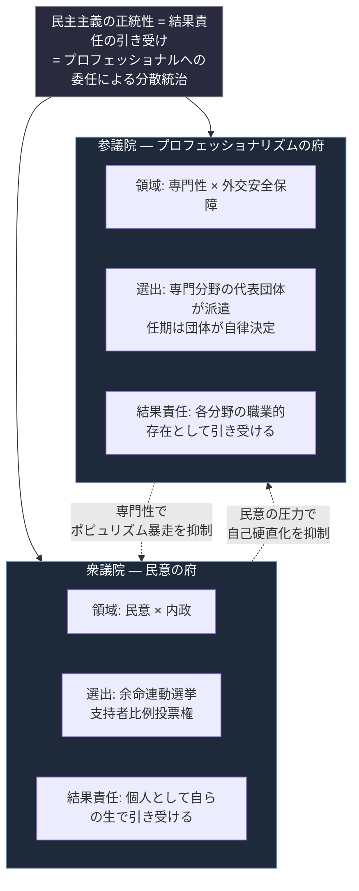

# 民主主義v2の設計

民主主義は完成された制度ではない。歴史的に形成され、特定の前提の上に成り立ち、特定の領域で機能し、特定の限界を持つ一つのバージョンに過ぎない。本稿ではこれをv1と呼ぶ。

v1と呼ぶことで二つのことが可能になる。第一に、民主主義の絶対視から距離を取り、制度としての欠陥を冷静に分析できる。第二に、v2の存在を前提とした議論ができる。民主主義の欠陥を指摘することは民主主義の全否定ではなく、次のバージョンへの設計作業になる。

本稿の目的は、v1の構造的欠陥を特定し、v2の設計を提示することである。設計は原理からの演繹によって構築し、各論(特定の政策や判断)には踏み込まない。

## 全体像

両院は異なる原理で動き、異なる領域を管轄し、互いを構造的に抑制する。しかし両院ともに民主主義の正統性の源泉である結果責任の引き受けに立脚しており、その引き受け方が異なるだけである。この設計は、v1民主主義の三つの構造的欠陥(時間軸の歪み、領域と手法のミスマッチ、空間的歪み)を同時に解消する。

平時の統治は01から05までの構造で回る。ただし両院が妥協不能に陥る危機事態に備え、06で別層の機能を設計する。

## 構成

- [01. v1民主主義の構造的欠陥](./01-structural-flaws.md) — 時間軸の歪み、領域と手法のミスマッチ、空間的歪み
- [02. 民主主義の再定義](./02-redefinition.md) — 結果責任を正統性の源泉とする分散統治
- [03. v2の設計 - 衆議院](./03-house-of-representatives.md) — 民意と内政の府、余命連動選挙、支持者比例投票権
- [04. v2の設計 - 参議院](./04-house-of-councillors.md) — プロフェッショナリズムと外交安全保障の府、自己組織化
- [05. 二院の相互チェック](./05-mutual-check.md) — 異なる原理による構造的抑制
- [06. 危機事態](./06-crisis.md) — 両院が妥協不能に陥った時の天皇と摂政の機能

## 結語

v2は、v1民主主義の全否定ではない。v1が蓄積してきた代議制の意義、分散統治の理念、相互抑制の発想を継承しつつ、v1の構造的欠陥を除去する設計である。

v1の三つの欠陥、時間軸の歪み、領域と手法のミスマッチ、空間的歪みは、いずれも「選挙一元化」という根本的誤謬から派生する。民主主義の正統性の源泉を結果責任の引き受けと捉え直し、選挙を委任の一形態として相対化することで、選挙一元化を解消できる。その上で、衆議院を民意と内政の府として純化し、参議院を専門性と外交安全保障の府として再構築し、両院の相互チェックで全体を安定させる。これが平時の設計である。加えて、両院が妥協不能に陥る危機事態に備え、天皇と摂政による別層の機能を設計する。これがv2の全体像である。

この設計は、あらゆる問題をパッチで覆い隠してきたv1の姿勢とは対照的である。v1は少子化を移民で、農業問題を補助金で、財政問題を国債で、根本原因を問わずに覆い隠してきた。覆い隠しのコストは将来世代に転嫁される。v1自身の構造的欠陥がこの覆い隠しを生んでおり、覆い隠しの継続はv1の欠陥を固定化する。

v2はパッチではない。原理からの再設計である。v1を絶対視する立場からは、v2は破壊的に見えるかもしれない。しかしv1を歴史的に形成された一つのバージョンと捉えれば、v2は必要な更新である。民主主義は完成した制度ではなく、バージョン管理の対象である。v1の問題を直視することは、民主主義を否定することではなく、民主主義の次のバージョンを準備することである。

民主主義v2の設計は、ここで提示した骨格に留まる。具体的な制度設計、移行プロセス、細部の運用は、今後の課題として残る。本稿の目的は、v1の絶対視から脱却し、v2の設計空間を開くことにある。民主主義は、このように再設計可能な対象である。
