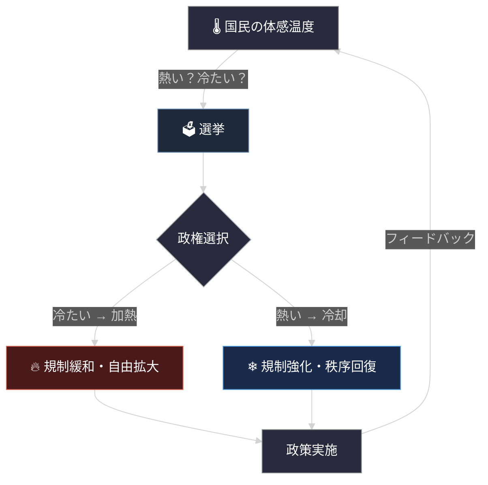

# 社会温度論 --- 政治の熱力学

## 基本概念

**社会には温度がある。** この前提に立つと、政治の風景が整理できる。

## 社会温度の定義

### 温度とは

```
社会温度 T = 無秩序度（エントロピー）
```

- **低温（0K付近）**: 完全秩序（全体主義、独裁）
- **高温（極端）**: 完全自由（アナーキー、無政府状態）
- **適温**: 創発が最大化される温度帯

<svg viewBox="0 0 600 320" xmlns="http://www.w3.org/2000/svg" style="max-width:600px; font-family: sans-serif;">
  <rect x="60" y="20" width="160" height="240" fill="#1a2332" rx="4"/>
  <rect x="220" y="20" width="160" height="240" fill="#1a3328" rx="4"/>
  <rect x="380" y="20" width="160" height="240" fill="#331a1a" rx="4"/>
  <text x="140" y="50" text-anchor="middle" fill="#6a8caf" font-size="13">秩序相</text>
  <text x="300" y="50" text-anchor="middle" fill="#6aaf8c" font-size="13">カオスの淵</text>
  <text x="460" y="50" text-anchor="middle" fill="#af6a6a" font-size="13">無秩序相</text>
  <line x1="60" y1="260" x2="540" y2="260" stroke="#555" stroke-width="1.5"/>
  <line x1="60" y1="260" x2="60" y2="20" stroke="#555" stroke-width="1.5"/>
  <text x="300" y="295" text-anchor="middle" fill="#aaa" font-size="13">社会温度</text>
  <text x="80" y="280" fill="#aaa" font-size="11">低</text>
  <text x="500" y="280" fill="#aaa" font-size="11">高</text>
  <text x="25" y="145" text-anchor="middle" fill="#aaa" font-size="13" transform="rotate(-90, 25, 145)">創発率</text>
  <path d="M 70,250 C 120,245 160,230 200,190 C 240,150 260,80 300,65 C 340,80 360,150 400,190 C 440,230 480,245 530,250" fill="none" stroke="#4fc3f7" stroke-width="2.5" stroke-linecap="round"/>
  <path d="M 70,250 C 120,245 160,230 200,190 C 240,150 260,80 300,65 C 340,80 360,150 400,190 C 440,230 480,245 530,250" fill="none" stroke="#4fc3f7" stroke-width="6" stroke-linecap="round" opacity="0.15"/>
  <circle cx="300" cy="65" r="4" fill="#4fc3f7"/>
  <text x="300" y="55" text-anchor="middle" fill="#4fc3f7" font-size="11">創発最大</text>
  <line x1="220" y1="20" x2="220" y2="260" stroke="#444" stroke-width="1" stroke-dasharray="4,4"/>
  <line x1="380" y1="20" x2="380" y2="260" stroke="#444" stroke-width="1" stroke-dasharray="4,4"/>
  <text x="140" y="248" text-anchor="middle" fill="#556" font-size="10">硬直・停滞</text>
  <text x="300" y="248" text-anchor="middle" fill="#565" font-size="10">創発の最適点</text>
  <text x="460" y="248" text-anchor="middle" fill="#655" font-size="10">崩壊・混沌</text>
</svg>

## 政治勢力の熱力学的理解

### 右翼 = 加熱装置

- 個人の自由を拡大
- 規制緩和
- 競争促進
- 社会のエントロピー増大

### 左翼 = 冷却装置

- 集団の秩序を強化
- 規制強化
- 平等化
- 社会のエントロピー減少

### ここが大事なポイント

**どちらも必要な機能だ**ということ。右翼も左翼もそれぞれ「正しい」場面がある。状況に応じて加熱と冷却を切り替える必要がある。イデオロギーの問題ではなく、温度調節の問題として捉えなければならない。

## イデオロギーと温度の対応

もう少し具体的に見てみる。

### 冷却側（秩序を高める方向）

- 共産主義・社会主義
- 平等重視、統制経済、規制強化、変化の抑制
- エントロピー減少方向

### 中間（動的バランス）

- 現代の自由主義
- 平等と自由のバランス、混合経済、適度な規制
- カオスの淵を維持する領域

### 加熱側（自由度を高める方向）

- 極端な自由放任、弱肉強食
- 無規制、格差拡大、構造崩壊のリスク
- エントロピー増加方向

## 社会温度と創発の関係

### 低温すぎる社会（例：北朝鮮）

- 硬直化、イノベーションが生まれない
- 創発がほぼゼロ
- システム価値の低下

### 高温すぎる社会（例：内戦状態）

- 構造が崩壊する
- エネルギーが散逸する
- 持続不可能

### 適温の社会

- 適度な自由と秩序
- 活発な創発
- 持続可能な発展

## システム価値の時間軸

社会温度論の背景には、次の定義がある。

```
システム価値 = 創発 × 存続期間
```

創発が大きくても、システムが短命であれば価値は限定的になる。逆に、長く存続しても創発がゼロに近ければ価値は低い。

この式が意味するのは、**温度管理は一瞬の最適化ではなく、時間軸を含んだ制御の問題だ**ということ。

- **独裁体制**: 秩序を強制して短期的に安定するが、創発が抑圧されるため長期的な価値は低い
- **無政府状態**: 一時的に自由度が爆発するが、構造が崩壊して存続できない
- **カオスの淵を維持する体制**: 創発を最大化しつつ、存続期間も確保する。システム価値が最大になる

温度管理の目標は、この「創発 × 存続期間」を最大化する温度帯を維持し続けることにある。

## 各国の温度診断

### 日本：やや低温

- 変化への抵抗感、同調圧力、イノベーションの出にくさ
- 「冷えている」印象がある
- 加熱方向の政策が必要だ

### アメリカ：高温寄り

- 社会の分断、対立の激化
- 「熱すぎる」状態にある
- 冷却方向の政策が求められている

### 北欧：適温に近い

- 福祉と市場のバランス
- 創発性が高い
- 安定的に発展している

## 議会制民主主義 = 自動温度調節システム

### そのメカニズム



民主主義の本質は、イデオロギーの対立ではなく、社会の温度調節を自動化する仕組みだ。選挙は温度計測、政党は加熱器と冷却器の役割を果たす。

## 二大政党制の合理性

### 二大政党制 = ON/OFF制御

二大政党制は、制御工学でいう**ON/OFF制御**に相当する。

- 「熱すぎる」→ 冷却側の政党を選ぶ（OFF）
- 「冷えすぎる」→ 加熱側の政党を選ぶ（ON）
- シンプルな二択なので国民にとってわかりやすい
- 安定的な振動（政権交代のサイクル）が生まれる

### 多党制 = PID制御

多党制は、制御工学でいう**PID制御**に近い構造になる。

- 比例（P）: 現在の温度偏差に応じた調整
- 積分（I）: 過去の蓄積された偏差への対応
- 微分（D）: 変化の速度への反応

理論的にはPID制御のほうが精密だが、パラメータの調整が難しい。多党制で連立政権を組む際の交渉コスト、方向性の発散リスクは、この「調整の難しさ」に対応している。

### 一党独裁の問題

- 温度調節機能そのものが壊れる
- 一方向にしか調節できない
- いずれ破綻する

### アメリカの例

米国の二大政党制をこの枠組みで見ると、構造がはっきりする。

- **民主党**: 冷却装置。福祉拡大、規制強化、再分配、格差是正。社会温度を下げる方向。
- **共和党**: 加熱装置。市場重視、規制緩和、競争促進、自己責任。社会温度を上げる方向。

社会が冷えすぎれば共和党が選ばれ、熱くなりすぎれば民主党が選ばれる。これが温度調節のサイクルになっている。

## 日本の政治システムが抱える課題

### 自民党の調整力

一党が長期間支配的な状態は、一見すると社会が硬直しているように見える。しかし自民党の場合、党内の派閥構造が規制強化と規制緩和の両方を内包しており、選挙結果や世論を読みながら政策の匙加減を変えている。二大政党制が政権交代で実現する振り子を、一党内の力学で回している構造だ。

この仕組みが機能している限り、社会のバランスは保たれている。ただし一党内の振り子は、政権交代に比べると振幅が小さくなりやすい。外からの強制的なフィードバックがないぶん、微調整にとどまり、大きな構造変化には対応しにくい面がある。

### 日本への示唆

1. **一党内調節の限界を認識する** --- 自民党の内部振り子は機能しているが、振幅が小さい。大きな構造変化には外部からのフィードバックが必要
2. **イデオロギーより機能** --- 右か左かではなく、今の社会に必要なのは規制か自由かで考える
3. **振り子の受容** --- 政権交代は失敗ではなくバランスの回復プロセス

### ポピュリズムの構造

民主主義の基本原理は、プロフェッショナリズムへの委任の連鎖だ。国民は自分では判断できない領域を専門家に委ね、選挙はその委任先への評価として機能する。国民の意見はあくまでもプロフェッショナリズムに対する評価であって、政策そのものの設計ではない。

ポピュリズムは、この委任構造を壊す。国民がプロをないがしろにし、専門的判断を「民意」で上書きしようとする。社会の匙加減には専門的な知見と経験が必要だが、ポピュリズムはそれを素人の直感で代替しようとする。結果として、過剰な加熱や過剰な冷却が起き、社会のバランスが崩れる。

調整力のある与党はプロとして匙加減をしている。野党が批判に特化して調整力を失うのも、ポピュリズムに迎合して「民意」を代弁する役割に自らを限定してしまうからだ。

## 歴史的事例

### 明治維新

- 「冷えきった」江戸時代からの急速な加熱
- 社会の相転移（固体 → 液体のようなもの）

### フランス革命

- 過熱による爆発
- 相転移（液体 → 気体のようなもの）
- その後の恐怖政治で急冷却

### ソ連崩壊

- 極低温の計画経済が自然崩壊
- エントロピーの法則には逆らえない

### ニューディール（1930年代米国）

- 大恐慌という過熱・崩壊状態に対して
- 強力な冷却（規制強化・福祉拡大）で安定を回復

### レーガノミクス（1980年代米国）

- 過度の規制で硬直した社会に対して
- 加熱（規制緩和・減税）で経済を活性化

### アベノミクス（2010年代日本）

- 加熱を意図した政策（金融緩和・規制緩和）
- 効果は限定的だった
- 一方向のみの調節では構造的な問題に対処しきれないことを示唆している

## ポピュリズムの理解

### 急激な温度変化の要求

- 「今すぐ熱く！」「今すぐ冷やせ！」
- システムの熱容量を無視している
- 結果としてシステムを壊しかねない

## 社会温度の測定とフィードバック

### 定量的な指標

社会温度は直接測れないが、いくつかの指標で間接的に測定できる。

| 指標 | 測定対象 | 温度との関係 |
|------|----------|-------------|
| ジニ係数 | 不平等度 | 高い → 過熱の兆候 |
| 起業率 | 創発の活性度 | 適度に高い → 適温 |
| デモの発生頻度 | 社会的不満 | 急増 → 過熱 |
| 投票率 | システムへの参加度 | 極端な低下 → 冷えすぎ |

### 定性的な指標

- 社会の雰囲気
- メディアの論調
- 世代間の対立度

### フィードバック機構

これらの指標が、前述の温度調節ループの入力になる。選挙のサイクル（数年単位）だけでは応答が遅い。世論調査、経済指標のリアルタイム公開、市民の政策参加など、より短いサイクルでのフィードバック経路が温度管理の精度を高める。

## 応用の広がり

### 組織管理

- 硬直した組織には競争を導入して加熱
- 混乱した組織にはルールを導入して冷却

### 教育

- 管理的すぎる教育には自由度を増やして加熱
- 放任的すぎる教育には規律を導入して冷却

### 個人の生活

- マンネリには挑戦で加熱
- ストレス過多にはルーティンで冷却

## 現代の課題

### グローバル化の影響

- 国境を超えた熱の移動が起きている
- 一国だけでの温度管理が難しくなっている
- 国際協調の必要性が増している

### 技術革新の影響

- AIなどによる急速な変化
- 従来の温度調節機能では追いつかない可能性
- 新しい管理手法が必要になるかもしれない

## 国際関係への応用

- 国際システムにも温度がある
- 冷戦は文字通り「低温」の時代
- 現在は温度が上昇している局面に見える

## まとめ

政治の本質は、イデオロギーの対立ではなく、社会温度の管理だ。

システム価値は「創発 × 存続期間」で決まる。平等（冷却）と自由（加熱）のバランスを取り、創発が最大化される「カオスの淵」を維持し続けること --- それが温度管理の目標になる。議会制民主主義はこの温度調節を自動化する仕組みであり、二大政党制はそのもっともシンプルで効果的な形態だ、というのがこの考え方の結論になる。

---

*政治の本質は、イデオロギーではなく温度管理だ。*

<!-- REVIEW (2026-04-26)
| 軸 | スコア |
|---|---|
| 論理の一貫性 | 9/10 — 温度＝エントロピーから政治・歴史・応用まで一貫 |
| 独自性 | 9/10 — 左右＝ON/OFF制御、多党制＝PID制御の視点が秀逸 |
| Core整合性 | 10/10 — システム価値＝創発×存続期間を最も活発に展開 |
| 読みやすさ | 8/10 — 後半の指標セクションがやや冗長 |
| 完成度 | 8/10 — グローバル化・AI革新への処方箋が示唆的すぎる |
| 総合 | 8.8/10 |

political-temperature-control.md の独自論点を吸収済み。
-->
